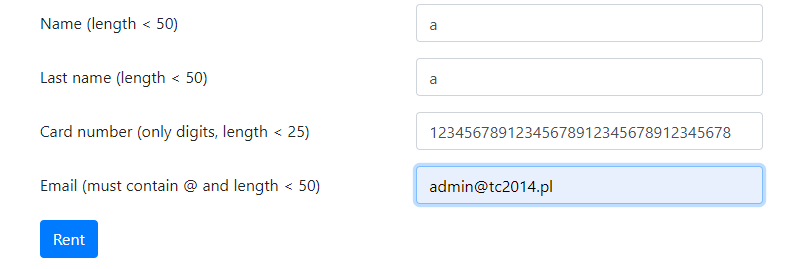

# Projekt końcowy SDA

# sesja eksploracyjna dla aplikacji http://qalab.pl.tivixlabs.com/

# Cel sesji: sprawdzenie fukcjonalności aplikacji webowej do wypożyczania pojazdów

1. W polu Country błędna nazwa - Germainy

2. Dane wejściowe: Country - Poland, City - Cracow, pick up date - 01.07.2023, drop-off date - 10.07.2023
    spodziewany efekty - aplikacja powinna wyrzucić błąd o wstecznej dacie wypożyczenia,
        możliwe wypożyczenie pojazdu z minioną datą

3. Dane wejściowe: Country - Poland, City - Cracow, pick up date - 01.07.2023, drop-off date - 10.07.2023, po wybraniu dowolnego poprzez przycisk rent przeniesienie do strony z koniecznością podania danych wypożyczającego, 
    spodziewany efekty - brak możliwości wypożyczenia pojazdu po podaniu w polach Name i Last name znaków specjalnych,
    aplikacja pozwala na wypożyczenie przy wpisaniu w Name i Last name znaku #
    
   ![**bład 2**][def]

[def]: image-1.png

4. Po wybraniu dowolnego pojazdu i kliknięciu Rent, dane wejściowe: Name - a, Last name - a, 
card number - dowolny ciąg cyfr powyżej 25 znaków, mail - dowolnym mail testowy
    spodziewany efekty - kominikat od błędnej ilości znaków w polu

5. Dane wejściowe: Country - France, City - Wroclaw, pick up date - dwolna data, drop-off date - dowolna data
    spodziewany efekt - komunikat o błędnym mieście względem kraju

6. Dane wejściowe: dowolny kraj i miasto, pick-up date 08.01.2027, drop-off date 08.10.2027.
    W mojej ocenie aplikacja powinna nie pozwalać na wynajem samochodu z tak odległą datą.
    
